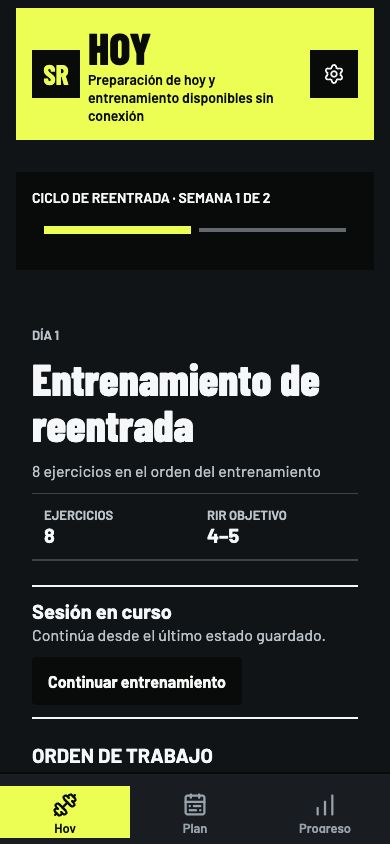
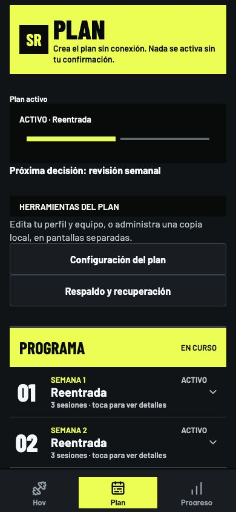
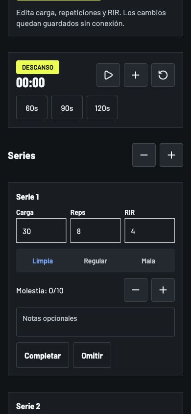

<p align="center">
  
</p>

<h1 align="center">Strength Rebuild</h1>

<p align="center">
  <strong>A training plan that continues beyond Monday.</strong><br>
  Plan your cycles. Log your sets. Keep your history on your device.
</p>

<p align="center">
  
  
  
  
  <a href="LICENSE"></a>
</p>

<p align="center">
  <a href="#screenshots">See the app</a> &middot;
  <a href="#installation">Run it locally</a> &middot;
  <a href="docs/PRIVACY.md">Privacy</a> &middot;
  <a href="CONTRIBUTING.md">Contribute</a>
</p>

---

## Purpose

Strength Rebuild is an Android-first training companion for three gym sessions a week. It connects multi-week programming with the work you actually record, instead of giving you the same checklist every Monday.

The core experience works offline after installation. No sign-in or cloud account is required. The current app interface is in Spanish.

| Before the workout | During the workout | After the workout |
| --- | --- | --- |
| Set your schedule, equipment, and reference loads. | Record each set, load, repetitions, and effort. | Review completed sessions and progress. |
| Preview reentry, hypertrophy, strength, power, and transition weeks. | Use rest timers and compatible exercise alternatives. | Keep original history intact, with explicit corrections. |
| Check readiness before starting. | Recover an unfinished session after reopening the app. | Export a password-protected backup when you choose. |

Cycle activation and weekly changes require confirmation. The calendar alone does not advance your training.

## Screenshots

<table>
  <tr>
    <th>Today</th>
    <th>Your plan</th>
    <th>Training</th>
  </tr>
  <tr>
    <td></td>
    <td></td>
    <td></td>
  </tr>
</table>

Actual product screens from the responsive web preview, using a fresh local database and synthetic demonstration settings. These are not mockups or personal training records. Native Android remains the supported installation target.

## Android support

| Requirement | Supported baseline |
| --- | --- |
| Android | Android 7.0 / API 24 or later |
| Node.js | 24.11.1, pinned in `.nvmrc` |
| npm | 11.6.2 or later in the 11.x line |
| Java | JDK 17 |
| Framework | Expo SDK 57, React Native, TypeScript |
| Device | Android emulator or a USB-connected development device |

Install Android Studio and its SDK tools before building. Native verification targets API 24 and API 35. iOS is not a verified release target.

## Installation

Build from source using an Android emulator or development device. A signed production APK is not available from this repository yet.

From a fresh checkout, with the supported toolchain available:

```sh
npm ci
npm run android
```

This creates and launches a **development build** that normally uses the development server. Use a dedicated emulator or test device, not an installation containing your only copy of training records.

The app includes a custom native module, so a development build is required; Expo Go is not the supported path. Once the development build is installed, restart its JavaScript server with `npm start`.

**First session:** open **Plan**, review **Configuraci&oacute;n del plan**, create a preview, and confirm activation. Then use **Hoy** to complete readiness and start the session. Fresh defaults are synthetic examples, not recommendations for your own training loads.

## Architecture

The interface uses chartreuse, ink, and paper, with Barlow typography and Lucide icons. Shared components keep planning, training, and history consistent, including reduced-motion preferences.

| Layer | Responsibility |
| --- | --- |
| [Routes](src/app) | Expo Router navigation and application entry points. |
| [Features](src/features) | Today, plan, workout, progress, readiness, settings, and backup screens. |
| [Design system](src/design-system) | Shared tokens, typography, components, and motion policy. |
| [Application](src/application) | Session workflows, transactions, progression, and portable backups. |
| [Domain](src/domain) | Deterministic cycle, prescription, safety, and substitution rules. |
| [Data](src/data) | SQLite migrations, repositories, and the exercise catalog. |

SQLite is the canonical on-device store. Completed workout history is immutable; supported corrections append audit records instead of silently replacing the original session.

## Verification

After installing dependencies, run:

```sh
npm run check
```

This runs lint, type checking, unit and SQLite integration tests, locked Expo compatibility, Expo Doctor, the dependency advisory policy, and a production web export. It stops at the first failure.

For focused development:

```sh
npm run lint
npm run typecheck
npm test -- --runInBand --ci
```

See [Testing](docs/TESTING.md) for coverage and platform limitations. The badges above describe the stack and license, not build status.

## Privacy by design

- Plans, readiness answers, and workout history live in the app's local SQLite database.
- New portable backups use password-based authenticated encryption. Legacy backup formats do not offer the same protection.
- Sharing a backup is an explicit action. The receiving application controls the copy you send.
- The app cannot recover a forgotten backup password. Keep a separate, secure copy of it.

Read [Privacy and data handling](docs/PRIVACY.md), [Portable backup privacy](docs/BACKUP_PRIVACY.md), and [Security](SECURITY.md) before using real records.

## Limitations

- This is a training log, not a medical device. It does not diagnose conditions, prescribe treatment, or guarantee fitness outcomes.
- There is no cloud synchronization or remote account recovery. Local records and exported backups still need appropriate protection.
- Dependency verification currently includes [time-limited advisory exceptions](SECURITY.md#known-dependency-advisories); a passing check does not mean a zero-finding security audit.
- Android is the supported runtime. The browser export is a preview; the web development command currently has an Expo SQLite worker-bundling limitation.
- There is no bulk in-app deletion control. See [deletion and retention](docs/PRIVACY.md#deletion-and-retention) before storing real data.
- Automated checks complement, but do not replace, testing a signed release on a physical phone.

## License

Licensed under the [MIT License](LICENSE). Copyright (c) 2026 Matias Matthews.

Third-party libraries, icons, and fonts retain their own licenses. See [Third-party notices](docs/THIRD_PARTY_NOTICES.md).

---

[Contributing](CONTRIBUTING.md) &middot; [Changelog](CHANGELOG.md) &middot; [Security](SECURITY.md) &middot; [License](LICENSE)
